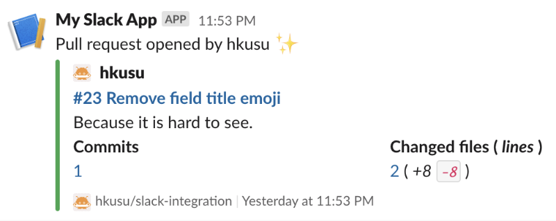
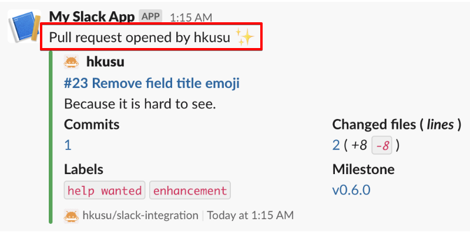
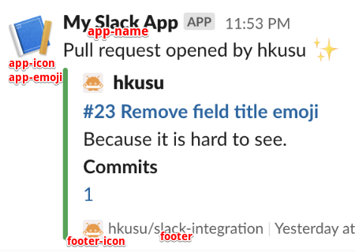
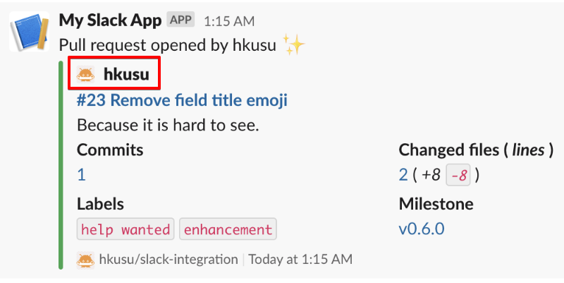
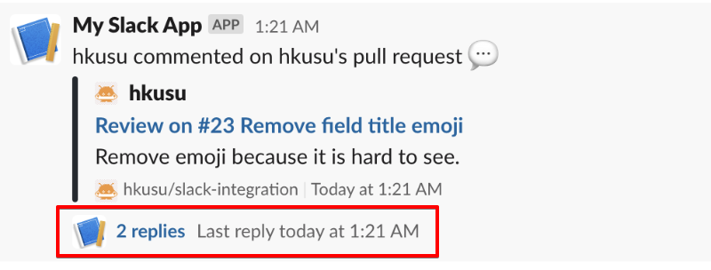
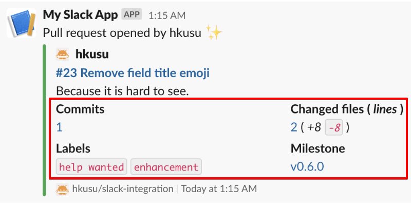

# Slack Integration

This Action sends pull request and issue events to your Slack channel.
This is useful in environments where [official integration](https://github.com/integrations/slack) is not available, such as Slack Enterprise Grid.



## Usage

### Basic

```yaml
name: Slack Integration

on:
  pull_request:
    types: [opened, reopened, ready_for_review, closed]
  issues:
    types: [opened, reopened, closed]
  pull_request_review:
    types: [submitted]
  issue_comment:
    types: [created]

jobs:
  slack-integration:
    runs-on: ubuntu-latest
    steps:
      - uses: hkusu/slack-integration@v1
        with:
          slack-token: ${{ secrets.SLACK_TOKEN }}
          channel: 'my-report-channel'
          subscribe-pulls: true
          subscribe-issues: true
          subscribe-reviews: true
          subscribe-pull-comments: true
          subscribe-issue-comments: true
```

**Note**:
This YAML file must be in the head branch of the pull request to handle `pull_request` and `pull_request_review` events.
Also, to handle `issue` and `issue_comment` events that need to be in the default branch.
`issue_comment` event is required not only for issues but also for pull request comments.

### Action inputs

#### Basic

| Name | Description | Default |
| --- | --- | --- |
| `slack-token` | (Required) Your Slack App token. | |
| `channel` | (Required) Slack channel to send a message. | |
| `subscribe-pulls` | Subscribe to pull request open, reopen, ready, and close events. | `false` |
| `subscribe-issues` | Subscribe to issue open, reopen, and close events. | `false` |
| `subscribe-reviews` | Subscribe to pull request review submit events. | `false` |
| `subscribe-pull-comments` | Subscribe to pull request comment events. | `false` |
| `subscribe-issue-comments` | Subscribe to issue comment events. | `false` |

#### Message



All inputs are **optional**. 
In the message you set, `<actor>` is replaced with the username that took the action.
Similarly, `<author>` is replaced by the creator of the pull request or issue.

| Name | Description | Default |
| --- | --- | --- |
| `pull-open-message` | Pull request opened. | `Pull request opened by <actor> :sparkles:` |
| `pull-reopen-message` | Pull request reopened. | `Pull request reopened by <actor> :recycle:` |
| `pull-draft-open-message` | Draft pull request opened. | `Draft pull request opened by <actor> :memo:` |
| `pull-draft-reopen-message` | Draft pull request reopened. | `Draft pull request reopened by <actor> :memo:` |
| `pull-ready-message` | Pull request ready for review. | `Pull request ready for review by <actor> :sparkles:` |
| `pull-close-message` | Pull request closed. | `Pull request closed by <actor> :heavy_multiplication_x:` |
| `pull-merge-message` | Pull request merged. | `Pull request merged by <actor> :twisted_rightwards_arrows:` |
| `pull-comment-message` | Commented on pull request. |  |
| `issue-open-message` | Issue opened. | `Issue opened by <actor> :sparkles:` |
| `issue-reopen-message` | Issue reopened. | `Issue reopened by <actor> :recycle:` |
| `issue-close-message` | Issue closed. | `Issue closed by <actor> :heavy_multiplication_x:` |
| `issue-comment-message` | Commented on issue. |  |
| `review-approve-message` | Approved in review. | `<actor> approved <author>''s pull request :white_check_mark:` |
| `review-request-changes-message` | Requested change in review. | `<actor> requested changes on <author>''s pull request :no_entry:` |
| `review-comment-message` | Commented in the review. | `<actor> commented on <author>''s pull request :speech_balloon:` |

#### App and footer



| Name | Default |
| --- | --- |
| `app-name` |  |
| `app-icon` |  |
| `app-emoji` |  |
| `footer` | `<${{ github.event.repository.html_url }}\|${{ github.event.repository.full_name }}>` |
| `footer-icon` | `${{ github.event.repository.owner.avatar_url }}` |

#### Actor



| Name | Description | Default |
| --- | --- | --- |
| `show-pull-actor` |  | `true` |
| `show-issue-actor` |  | `true` |
| `show-review-actor` |  | `true` |
| `show-pull-comment-actor` |  | `true` |
| `show-issue-comment-actor` |  | `true` |

#### Threading comments



| Name | Default |
| --- | --- |
| `threading-comments` | `false` |

#### Pull request details



| Name | Default |
| --- | --- |
| `show-pull-detail` | `true` |

## License

[MIT](LICENSE)
